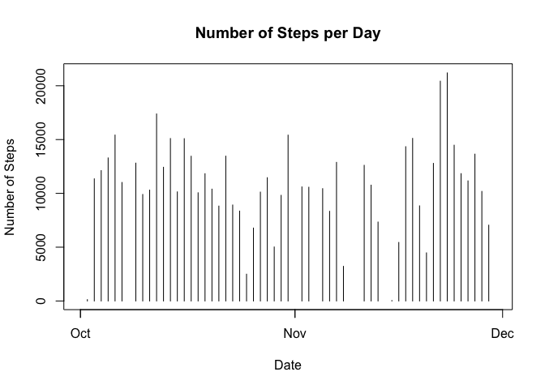
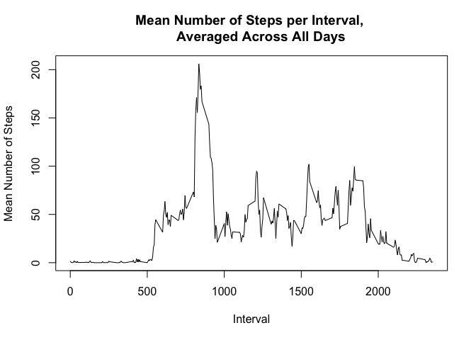
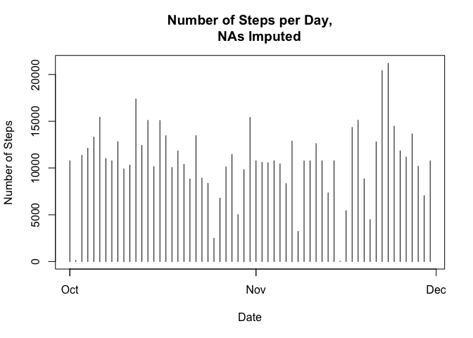
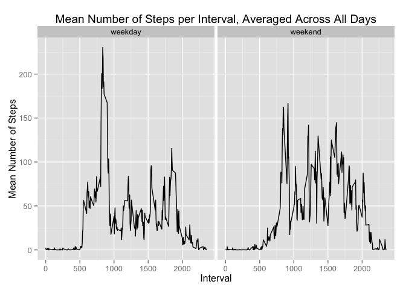

# Reproducible Research: Peer Assessment 1

## Loading and preprocessing the data
Load required libraries

```r
library(lubridate)
library(dplyr)
```

```
## 
## Attaching package: 'dplyr'
## 
## The following objects are masked from 'package:lubridate':
## 
##     intersect, setdiff, union
## 
## The following objects are masked from 'package:stats':
## 
##     filter, lag
## 
## The following objects are masked from 'package:base':
## 
##     intersect, setdiff, setequal, union
```

```r
library(ggplot2)
```

Downlaod and uzip file


```r
activity_fileURL <- "https://d396qusza40orc.cloudfront.net/repdata%2Fdata%2Factivity.zip"
download.file(activity_fileURL, destfile="activity.zip", method="curl")
unzip("activity.zip")
```

Load in the activity file needed


```r
classes <- c("integer", "character", "integer")
activity <- read.csv(file='activity.csv', sep=",", header=T, colClasses = classes, na.strings="NA")
```

Preprocess the data by converting the date column using lubridate and converting the data frame to a dplyr dataframe


```r
activity[,'date'] <- ymd(activity[,'date'])
new_activity <- tbl_df(activity)
```

## What is mean total number of steps taken per day?
Using the dplyr package, group the data by date and then sum number of steps per day


```r
grouped_date <- group_by(activity, date)
steps_by_date <- summarise_each(grouped_date, funs(sum), steps)
```

Plot the histogram of number of steps per day


```r
plot(steps_by_date, type="h", xlab="Date", ylab="Number of Steps", main="Number of Steps per Day")
```

 

Calculate the mean and median of the number of steps per day


```r
mean_steps <- mean(steps_by_date$steps, na.rm=T)
median_steps <- median(steps_by_date$steps, na.rm=T)
```

The mean number of steps taken per day is 1.0766 &times; 10<sup>4</sup>.
The median number of steps taken per day is 10765.

## What is the average daily activity pattern?
Using the dplyr package, group the data by interval and then calculate the mean number of steps for that interval, across all days


```r
grouped_interval <- group_by(activity, interval)
mean_interval_steps <- summarise_each(grouped_interval, funs(mean(., na.rm = TRUE)), steps)
```

Plot the mean number of steps per interval


```r
plot(mean_interval_steps, type="l", xlab="Interval", ylab="Mean Number of Steps",  main="Mean Number of Steps per Interval, 
     Averaged Across All Days")
```

 

Determine the interval with max number of average steps


```r
max_index <- which(mean_interval_steps$steps == max(mean_interval_steps$steps))
max_interval <- mean_interval_steps$interval[max_index]
```

The 5-minute interval with the maximum number of steps, averaged across all days, is interval 835.

## Imputing missing values
To impute missing values, first need to determine number of steps with NA as the value


```r
NA_index <- which(is.na(grouped_interval$steps))
number_NA <- length(NA_index)
```

The missing data will be imputed using the mean of the interval (previously calculated when determining 
average daily activity pattern).  First a new dataframe will be created of the original data which had a 
missing value for the number of steps.


```r
NA_data <- data.frame(steps=grouped_interval$steps[NA_index],
                      date=grouped_interval$date[NA_index], interval=grouped_interval$interval[NA_index])
```

The mean number of steps for a given interval will be used as the new step value when the number of steps
is missing (eg, mean_interval_steps is being used as a look up table based on the interval to determine
the new step value)


```r
imputed_steps <- mean_interval_steps[match(NA_data$interval, mean_interval_steps[,1]),2]
NA_data$steps <- imputed_steps
```

Create a new dataset with imputed steps replacing NAs


```r
imputed_grouped_interval <- grouped_interval
imputed_grouped_interval[NA_index,] <- NA_data
```

Using the dplyr package, group the new imputed data by date and then sum number of steps per day


```r
grouped_imputed_date <- group_by(imputed_grouped_interval, date)
imputed_steps_by_date <- summarise_each(grouped_imputed_date, funs(sum), steps)
```

Plot the histogram of number of steps per day using the imputed data


```r
plot(imputed_steps_by_date, type="h", xlab="Date", ylab="Number of Steps", main="Number of Steps per Day,
     NAs Imputed")
```

 

Calculate the mean and median of the number of steps per day using the imputed data


```r
imputed_mean_steps <- mean(imputed_steps_by_date$steps)
imputed_median_steps <- median(imputed_steps_by_date$steps)
```

The mean number of steps taken per day using the imputed data is 1.0766 &times; 10<sup>4</sup>.
The median number of steps taken per day using the imputed is 1.0766 &times; 10<sup>4</sup>.
These values differ only slightly from the median calculated by ignoring missing values and 
are the same as those as the mean calculated by ignoring missing values.  The effect of imputing
the missing values has a relatively small impact on the estimates of the total daily number of steps.

## Are there differences in activity patterns between weekdays and weekends?

To create a new factor variable with the "weekday" or "weekend" level, determine day of week 
of the date using the lubridate package and add it as the variable "wday" to the imputed data set


```r
imputed_grouped_interval$wday <- wday(imputed_grouped_interval$date)
```

Using this new day of week variable, create a new variable "day_type" and assign the levels "weekend" 
or "weekday", where a value of "1" (Sunday) or "7" (Saturday) is assigned as "weekend" and all other values
are assigned as "weekday"


```r
for (i in 1:nrow(imputed_grouped_interval)) {
        if(imputed_grouped_interval$wday[i] %in% c(1,7)) {
                imputed_grouped_interval$day_type[i] = "weekend"
        } else {
                imputed_grouped_interval$day_type[i] = "weekday"
        }
}
```

Using the dyplr pacakge, group by weekend or weekday and calculate mean interval steps


```r
grouped_day_type <- group_by(imputed_grouped_interval, day_type, interval)
mean_interval_steps_day_type <- summarise_each(grouped_day_type, funs(mean(., na.rm = TRUE)), steps)
```

Plot mean number of steps per interval for weekend vs weekday using the ggplot 2 package


```r
ggplot(mean_interval_steps_day_type, aes(x=interval, y=steps)) + geom_line()+ facet_wrap(~day_type) +
        xlab("Interval") + ylab("Mean Number of Steps") + ggtitle("Mean Number of Steps per Interval, Averaged Across All Days")
```

 
